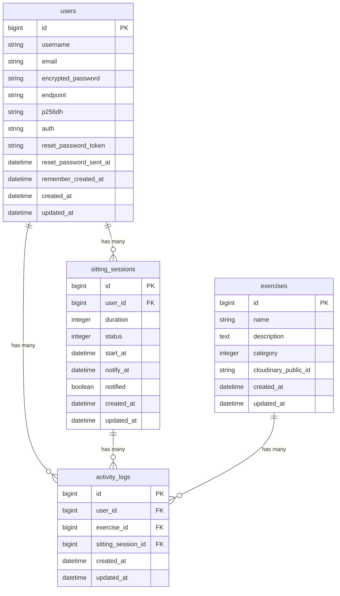

# 卒業制作

「iStanding」

  

## サービス概要

デスクワーカーの「座りすぎ」を防ぐタイマーアプリ。

医学的根拠に基づいた通知タイミングと効果的な行動提案で健康習慣をサポート。

通知機能や座位時間の可視化により、健康的な習慣を無理なく継続できます。

サービスURL: https://istanding.jp

## このサービスへの思い・作りたい理由

理学療法士として整形外科で働く中で、腰痛や首の痛みを訴える患者様から「デスクワークで一日中座っています」という言葉を何度も耳にしてきました。日本は座位時間が世界トップレベルで、WHO や厚生労働省も座りすぎによる肥満、心筋梗塞、脳梗塞、ヘルニア、高血圧、糖尿病などのリスクを警告しています。

0 次医療(予防医療)の推進が叫ばれる今、最も必要なのは「わかっているけどできない」を「自然とできる」に変えることです。多くの方が座りすぎの害を知りながらも、「めんどくさい」「まだ大丈夫」「忘れてしまう」「何をしたらいいかわからない」という理由で行動に移せていません。

このアプリは、理学療法士としての専門知識を活かし、デスクワーカーが無理なく座りすぎを防ぎ、健康的な習慣を継続できるようサポートします。

**参考文献**：

- [Sitting Time and All-Cause Mortality Risk in 222,497 Australian Adults](https://jamanetwork.com/journals/jamainternalmedicine/fullarticle/1108810)
- [Sedentary time and its association with risk for disease incidence, mortality, and hospitalization in adults](https://pubmed.ncbi.nlm.nih.gov/21767731/)

## ユーザー層について

**メインターゲット**：デスクワークが多い 20〜40 代の会社員・フリーランス

この層を対象にした理由：

1 日 8 時間以上座って仕事をする人が多く、座りすぎによる健康リスクが高い
仕事に集中すると立ち上がることを忘れがちで、客観的なアラートが必要
SNS を日常的に使用しており、達成実績のシェアによるモチベーション維持が期待できる
スマートフォンや PC を常時使用しているため、アプリの導入・利用ハードルが低い
健康意識が高まる年代で、予防的な健康管理に関心がある

## サービスの利用イメージ

1. **作業中のサポート**：設定した間隔（例：60 分）で座りすぎアラートが通知される
2. **休憩時間の内容提案**：休憩アクションを提案（ストレッチ、歩く、立ち作業など）
3. **1 日の振り返り**：座位時間の推移や休憩回数をグラフで確認
4. **リマインドによる継続性**：自発的でなく受動的にアプリの利用を促す
5. **健康コラムによる啓発**：医学的な情報をエビデンスに基づき掲載

**得られる価値**：

- 座りすぎによる健康リスクの軽減（肩こり、腰痛、生活習慣病予防）
- データの可視化による行動変容の実感、健康意識の向上

## ユーザーの獲得について

- **SNS 拡散**

X(旧 Twitter)での達成実績シェア機能を実装
「#座りすぎ防止」「#デスクワーク改善」などのハッシュタグで拡散
シェアされた投稿から新規ユーザーが流入する仕組み

- **健康系コミュニティへのアプローチ**

産業医、産業理学療法など、企業の健康増進に携わるコミュニティへのアプローチ

その後、企業内の社員への普及というレバレッジが期待できる可能性

- **エンジニアコミュニティ（Qiita、Zenn など）での紹介**

デスクワーカーのコミュニティでの展開

- **コンテンツマーケティング**

座りすぎのリスクや改善方法に関する記事を SEO 対策を用いて Web サイトで発信

YMYL, E-E-A-T への留意が必要になる
実際の利用者の事例なども紹介

## サービスの差別化ポイント・推しポイント

### **類似サービスとの差別化**

**既存のストレッチアプリとの違い**：

- 「ストレッチの継続」ではなく「座位時間の削減」にフォーカス
- 休憩の種類を強制せず、歩く・立ち作業など柔軟な休憩方法を記録可能
- 座位時間の可視化により、行動変容を客観的に確認できる

**ポモドーロアプリとの違い**：

- 単なるポモドーロではなく、休憩時間にすべきことを提案、誘導
- デイリーチャレンジ、ダメージ可視化によるゲーミフィケーション要素
- SNS シェア機能による社会的なモチベーション維持

### **推しポイント**

1. **行動変容の可視化**：座位時間の推移グラフで改善を実感できる
2. **柔軟な休憩スタイル**：ストレッチに限定せず、自分に合った休憩方法を選択可能
3. **小さな成功体験の積み重ね**：毎日のチャレンジ達成で継続しやすい設計

## 機能一覧

### 実装済み

1. ユーザー登録・ログイン機能（Devise、ゲストログイン対応）
2. 座位時間アラート機能（Solid Queue + Web Push）

- 1分・60分・90分からタイマー時間を選択
- ブラウザを閉じていてもプッシュ通知が届く
- 通知クリックで運動提案モーダルが自動表示

3. 運動提案モーダル

- 理学療法士監修の運動を3つランダム提案
- ストレッチ・筋トレ・ウォーキングのカテゴリ別表示

4. ダッシュボード

- 今日の総座位時間・運動回数・進捗率を表示
- 週次の座位時間グラフ・運動回数グラフ（Chartkick + Chart.js）

5. 運動記録・履歴（運動完了を記録、履歴一覧で確認可能）

### 実装予定

1. SNSログイン（Google・GitHub認証）
2. PWA 化（ホーム画面への追加、オフライン対応）
3. ゲーミフィケーション（座位時間でキャラクターがダメージを受ける表現）
4. 連続記録ストリーク表示
5. タイマー時間のスライダー選択
6. 健康TIPS のランダム表示
7. admin 用 CRUD（運動メニューの追加・編集）
8. 動的 OGP

## 使用する技術スタック

| カテゴリ       | 技術                         | 採用理由                                                                         |
| -------------- | ---------------------------- | -------------------------------------------------------------------------------- |
| バックエンド   | Ruby on Rails 8.1 / Ruby 4.0 | Solid Queue等Rails 8新機能を活用しインフラをシンプルに保つ                       |
| フロントエンド | Hotwire（Turbo + Stimulus）  | タイマーのリアルタイム更新・モーダル表示をSPA的なUXでシンプルに実装              |
| フロントエンド | Tailwind CSS v4              | 高速な開発とモダンなUIの実現                                                     |
| データベース   | Neon（PostgreSQL）           | サーバーレスPostgreSQL。Render DBは90日で期限切れになるため採用                  |
| 認証           | Devise                       | メール認証・ゲストログイン対応。ドキュメントが豊富                               |
| インフラ       | Render                       | 無料枠でのデプロイが可能、設定がシンプル                                         |
| 画像管理       | Cloudinary                   | 運動メニューの説明画像をアップロード・管理                                       |
| 通知           | Web Push API + web-push gem  | ブラウザプッシュ通知の実装                                                       |
| ジョブ管理     | Solid Queue                  | Redis + Sidekiqの代わりにRails 8デフォルト機能を採用。任意の時刻に通知を予約送信 |
| グラフ         | Chartkick + Chart.js         | 週次の座位時間・運動回数グラフを表示                                             |
| テスト         | RSpec                        | 単体テスト・統合テスト                                                           |

## **画面遷移図**

画面遷移図[Figma](https://www.figma.com/design/JKk9gF7VlIXwZ6NmctJhtm/iStandiing?node-id=3-9&t=kKzcKVxdmVC17r2o-1)

## **ER 図**

