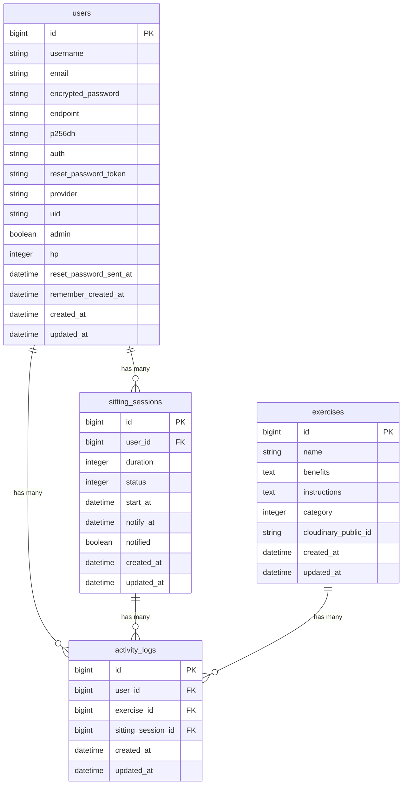

# 「iStanding」

  

  

## サービス概要

iStanding（アイ・スタンディング）は、デスクワーカーの「座りすぎ」を防ぎ、健康習慣をゲーム感覚で無理なく継続できるリマインダータイマーアプリです。
医学的根拠に基づいた通知タイミングと、理学療法士の知見を詰め込んだ効果的な運動提案によって、ユーザーの健康を強力にサポートします。

* **サービスURL:** https://istanding.jp
* **ゲストログイン機能搭載:** アカウント作成なしで体験可能です。

---

## 👨‍⚕️ 開発背景と解決したい課題

### 背景（原体験）
理学療法士として整形外科の臨床で12年間働く中で、腰痛や首の激しい痛みを訴える多くの患者様から「デスクワークで一日中座りっぱなしです」という声を何度も耳にしてきました。実は日本人の座位時間は世界トップレベルであり、WHOや厚生労働省も座りすぎによる肥満、心筋梗塞、脳梗塞、ヘルニア、糖尿病などの重大なリスクを警告しています。

### 課題
0次医療（予防医療）の推進が叫ばれる今、最も必要なのは**「リスクはわかっているけれど行動できない」を「自然とできる」に変えること**です。多くの方が座りすぎの害を知りながらも、「仕事に集中すると忘れる」「何をしたらいいかわからない」「面倒くさい」という理由で行動に移せていません。

### 解決アプローチ
本アプリは、受動的に届くプッシュ通知で強制的に「忘れる」を防止し、その場で1分あれば実践できる理学療法士監修の運動をランダムに提案します。さらに、座りすぎると体力が減る「HPシステム」を導入することで、「つい休憩したくなる」ゲーミフィケーション要素を持たせ、行動変容のハードルを極限まで下げました。

**💡 医学的参考文献**：
- [Sitting Time and All-Cause Mortality Risk in 222,497 Australian Adults](https://jamanetwork.com/journals/jamainternalmedicine/fullarticle/1108810)
- [Sedentary time and its association with risk for disease incidence, mortality, and hospitalization in adults](https://pubmed.ncbi模.gov/21767731/)

---
## ユーザー層について

**メインターゲット**：デスクワークが多い 20〜40 代の会社員・フリーランス

この層を対象にした理由：

1 日 8 時間以上座って仕事をする人が多く、座りすぎによる健康リスクが高い
仕事に集中すると立ち上がることを忘れがちで、客観的なアラートが必要
SNS を日常的に使用しており、達成実績のシェアによるモチベーション維持が期待できる
スマートフォンや PC を常時使用しているため、アプリの導入・利用ハードルが低い
健康意識が高まる年代で、予防的な健康管理に関心がある

## 🔥 サービスの推しポイント（他アプリとの差別化）

* **「ストレッチ」ではなく「座位時間の削減」にフォーカス**
  特定の運動を強制せず、立ち作業や家事、散歩などユーザーのライフスタイルに合わせた柔軟な休憩方法（自由運動）も分単位で正確に記録・管理できます。
* **行動変容を可視化する「草（ヒートマップ）」とストリーク**
  日々の運動継続をエンジニアに馴染み深い「草（ヒートマップ）」や連続継続日数としてダッシュボードに反映。小さな成功体験を積み重ねられます。
* **一目でヤバさが伝わる「HPゲージ」**
  座り続けた時間に応じてユーザーのHPがリアルタイムで減少する「ダメージシステム」を搭載。「今すぐ運動して回復しなきゃ！」という自発的な動機付けを促します。

* **既存のストレッチアプリとの違い**：

- 「ストレッチの継続」ではなく「座位時間の削減」にフォーカス
- 休憩の種類を強制せず、歩く・立ち作業など柔軟な休憩方法を記録可能
- 座位時間の可視化により、行動変容を客観的に確認できる

**ポモドーロアプリとの違い**：

- 単なるポモドーロではなく、休憩時間にすべきことを提案、誘導
- デイリーチャレンジ、ダメージ可視化によるゲーミフィケーション要素
- SNS シェア機能による社会的なモチベーション維持

---

## ✨ ユーザーの利用イメージ

1. **作業開始**
   * 作業前にタイマー（30分 / 45分 / 60分 / 90分など）を選択してスタート。
2. **通知（受動的なリマインド）**
   * バックグラウンド状態やブラウザを閉じている状態でも、時間になるとプッシュ通知が届きます。
3. **休憩・運動の実践**
   * 通知をクリックすると、理学療法士が監修した最適な運動メニューが3つランダムに提案されます。
4. **記録・回復**
   * 運動を完了するとHPが回復し、今日の総座位時間や運動回数の統計グラフ、およびカレンダーへ即座に反映されます。

---

## 📝 機能一覧

* **マルチチャネルユーザー認証基盤:** メールアドレスによる通常の登録・ログイン（Devise）に加え、**Google OAuth 2.0（OmniAuth）を用いたSNSサインイン**、およびデータの残らないゲストログインに対応。
* **座位時間アラート機能（Web Push）:** Web Push API ＋ Service Worker を活用し、ブラウザのバックグラウンド環境やタブを閉じている状態でもOSレイヤーで確実に届くプッシュ通知基盤。
* **PWA（Progressive Web Apps）対応:** スマートフォンやPCのホーム画面へのアプリ追加（インストール）に対応し、ネイティブアプリに近いUXを提供。
* **運動提案モーダル:** 理学療法士監修の運動（ストレッチ・トレーニング等）を3つランダム提案する動的UI（Hotwire/Stimulus）。自由運動（散歩や立ち作業など）を分単位で記録するカスタムログ機能。
* **データビジュアライゼーション:** 週次・月次の総座位時間および運動回数の統計グラフ表示（Chartkick + Chart.js）による行動変容の可視化。
* **ロールベースの権限管理と管理者機能（admin専用CRUD）:** Punditを用いた認可コントロールを実装。管理者権限（adminフラグ）を持つユーザー専用の管理画面を構築し、アプリに表示する運動メニューの追加・編集・表示切り替え（アクティブフラグ制御）をブラウザ上から操作可能。

---

## 🛠️ 技術スタック

| カテゴリ | 技術 | 採用理由・選定理由 |
| :--- | :--- | :--- |
| バックエンド | **Ruby on Rails 8.1 / Ruby 4.0** | Solid QueueやPWA対応など、Rails 8系の最新機能を積極的に取り入れインフラをシンプルに保つため。 |
| フロントエンド | **Hotwire (Turbo + Stimulus)** | リアルタイムなタイマーカウントダウンや、画面遷移を伴わないシームレスな運動提案モーダル表示を、SPA的な高いUXでシンプルに実装するため。 |
| フロントエンド | **Tailwind CSS v4.0** | 高速なスタイリングとモダンで直感的なUI（グラスモルフィズムやアニメーション）を効率的に実現するため。 |
| データベース | **Supabase (PostgreSQL)** | 💡**インフラの最適化:** 当初はサーバーレスPostgreSQLとしてNeonを採用していましたが、無料枠のコンピュート時間（1,000時間/月）の上限リスクを考慮。制限を回避しつつ、本番環境でも高いパフォーマンスと可用性を維持できるPostgreSQL基盤としてSupabaseへ移行しました。 |
| 認証 | **Devise / Devise-i18n** | 標準的なメールアドレス認証、およびOmniAuthを用いたGoogle OAuth 2.0認証を安全かつ迅速に統合するため。 |
| インフラ | **Render** | 個人開発におけるホスティングサービスとして設定がシンプルであり、無料枠の範囲内でSidekiq等の外部プロセスと同居させた運用が可能であるため。 |
| 画像管理 | **Cloudinary** | 理学療法士が監修した運動メニューの解説画像を、配信最適化（CDN）および軽量な容量でセキュアに管理・サーブするため。 |
| 通知基盤 | **Web Push API / web-push** | ブラウザやタブを閉じている状態のデスクワーカーに対しても、非同期で確実に「休憩のサイン」を届けるためのプッシュ通知基盤を構築するため。 |
| 非同期ジョブ管理 | **Sidekiq / Upstash (Redis)** | **インフラの最適化:** データベースの負荷とRenderのメモリ512MB制限を考慮し、軽量なインメモリKVSであるUpstash Redis（Singaporeリージョン）とSidekiqの組み合わせを選択。スレッド数を1に制限するチューニングを施し、完全な低メモリ安定稼働と確実な通知予約（永続化）を両立。 |
| グラフ可視化 | **Chartkick / Chart.js** | 週次・月次の総座位時間や運動回数の推移を、ユーザーが直感的に「行動変容」として実感できるよう美しいグラフで描画するため。 |
| テスト | **RSpec / FactoryBot** | モデル、ポリシークラス（Punditによる権限管理）、およびシステムの統合的な振る舞い（System Spec）の品質を担保するため。 |

## こだわり・工夫した点
### 1. インフラ制約に伴う技術選定の転換（Solid Queue ➔ Sidekiq + Upstash Redis）
* **背景と当初の狙い:**
  本アプリでは、Rails 8の最大の特徴である「追加インフラ（Redis等）なしでDBベースの非同期処理を実現する」という思想に共感し、**Solid Queue** を活用するためにRails 8を採用して開発をスタートしました。
* **直面した課題:**
  デプロイ先であるRenderの無料枠（メモリ512MB制限）において、RailsのWebプロセスに加え、Solid Queueの常駐プロセス（Supervisor/Worker/Dispatcher）が同時に稼働することでメモリを激しく圧迫。1.5〜2時間おきにメモリ上限超過（OOM Kill）によるアプリのクラッシュが多発する事態となりました。
* **意思決定と解決策:**
  「インフラ構成をシンプルに保つ」ことよりも「サービスの安定稼働と確実な通知予約（永続化）」を最優先と判断し、コア技術の選定を大幅に転換。データベース負荷と常駐メモリを極限まで削るため、インメモリKVSである **Sidekiq + Upstash Redis (Singaporeリージョン)** の構成へ完全移行しました。

## **画面遷移図**

画面遷移図[Figma](https://www.figma.com/design/JKk9gF7VlIXwZ6NmctJhtm/iStandiing?node-id=3-9&t=kKzcKVxdmVC17r2o-1)

## **ER 図**

